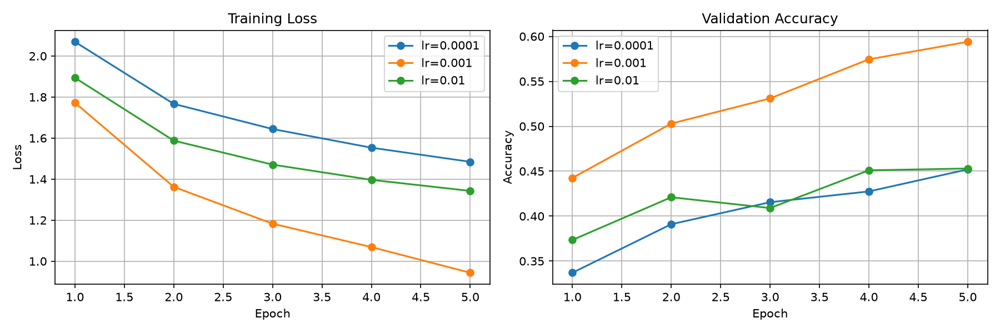

# PyTorch 学习记录：从学习率实验到文本 Padding 与 Mask

记录日期：2026-09-20。

今天沿着两条主线继续学习：

```text
图像模型：
控制变量实验 → 训练曲线 → 预训练ResNet18 → 冻结骨干 → 局部微调

文字模型：
文字指令 → token → token ID → Embedding
→ padding → attention mask → 句子特征
```

学习方式仍然是逐段阅读代码，将“知道代码在干什么”进一步对应到前向传播、反向传播、超参数、迁移学习、词嵌入等正式术语。

## 一、SGD 与 Adam 对照实验

`test32_compare_optimizers.py` 使用相同的：

- 训练数据；
- 模型结构；
- 初始参数；
- 学习率；
- 训练轮数；
- 损失函数。

唯一改变的是优化器：

```text
SGD
Adam
```

在简单线性回归任务中，SGD 在当前设置下比 Adam 收敛更快，说明：

> Adam 并不保证在所有任务和学习率下都优于 SGD。优化器表现取决于任务、模型和超参数。

训练过程只记录指定轮数的 loss：

```python
recorded_losses[epoch] = loss.item()
```

最终形成以 epoch 为键、loss 为值的字典。直接遍历字典：

```python
for epoch in sgd_losses:
```

默认遍历字典的键。

## 二、CIFAR-10 学习率实验

`test33_learning_rate.py` 在同一个 CNN 上比较三个学习率：

```text
0.0001
0.001
0.01
```

控制条件包括：

- 相同模型结构；
- 相同模型初始化；
- 相同训练和验证图片；
- 相同 batch 顺序；
- 相同 Adam 优化器；
- 相同训练轮数。

这类实验叫：

```text
控制变量实验（controlled experiment）
```

程序将每个 epoch 的指标保存在训练历史中：

```python
history = {
    "train_loss": [],
    "validation_accuracy": []
}
```

实际曲线：



实验现象：

- `0.0001`：loss 稳定下降，但收敛较慢；
- `0.001`：loss 下降最快，验证准确率最高，五轮后约为 59.4%；
- `0.01`：训练存在波动，验证准确率在部分轮次出现下降。

当前实验结论：

> 在相同设置下，Adam 使用 `lr=0.001` 的效果最好。但这个结论只适用于当前模型、数据和训练轮数，不能推广成所有任务的固定答案。

### loss 为什么乘 batch size

`CrossEntropyLoss` 默认返回当前 batch 的平均损失：

```python
batch_size = len(labels)
loss_sum += loss.item() * batch_size
```

先乘以实际 batch size，还原当前 batch 的损失总和；遍历完成后再除以总样本数，才能得到整个数据集按样本计算的平均损失。这样能够正确处理最后一个不足64张图片的 batch。

## 三、CPU、GPU、CUDA、内存和显存

```text
CPU
→ 少量但功能复杂的核心，适合程序逻辑和顺序任务

GPU
→ 大量并行核心，适合卷积和矩阵运算

CUDA
→ 让程序使用NVIDIA GPU进行计算的软件平台
```

数据训练过程可以概括为：

```text
硬盘保存数据
→ CPU读取到内存
→ DataLoader组成batch
→ Tensor送入显存
→ GPU完成模型计算
```

```text
内存 RAM
→ 主要供CPU使用

显存 VRAM
→ 主要供GPU使用

Cache
→ CPU或GPU计算核心附近、容量更小且速度更快的缓存
```

显存不是 Cache。显存更接近 GPU 自己的主内存；GPU 内部仍然有单独的 L1/L2 Cache 和寄存器。

## 四、路径与数据预处理

```python
project_folder = Path(__file__).resolve().parent.parent
data_folder = project_folder / "data"
artifact_folder = project_folder / "artifacts"
artifact_folder.mkdir(exist_ok=True)
```

- `__file__`：当前 Python 文件的路径；
- `resolve()`：转换成完整绝对路径；
- `parent.parent`：向上两层找到项目根目录；
- Path 对象的 `/`：拼接路径；
- `mkdir(exist_ok=True)`：确保目录存在，已存在时不报错。

`transforms.Compose` 将多个图片处理步骤组合成按顺序执行的数据预处理流水线。

## 五、预训练 ResNet18 与迁移学习

`test34_pretrained_resnet.py` 使用 ImageNet 预训练的 ResNet18。

```text
预训练模型
→ 已经在大型数据集上训练过的模型

迁移学习
→ 将已有模型学到的特征迁移到新任务

骨干网络
→ 负责提取图像特征的主体网络

分类头
→ 将图像特征变成具体任务的类别分数
```

ResNet18 原始结构最后是：

```text
骨干网络
→ 512个图像特征
→ Linear(512, 1000)
→ ImageNet的1000个类别分数
```

修改后：

```text
骨干网络
→ 512个图像特征
→ Linear(512, 10)
→ CIFAR-10的10个类别分数
```

核心代码：

```python
model = resnet18(weights=weights)

for parameter in model.parameters():
    parameter.requires_grad = False

feature_count = model.fc.in_features
model.fc = nn.Linear(feature_count, 10)
```

循环会先冻结包括原 `fc` 在内的全部已有参数；随后原 `fc` 被全新的 `Linear(512, 10)` 替换，新层参数默认可以训练。

### CIFAR-10 数据来自哪里

`datasets.CIFAR10` 是 Torchvision 提供的数据集读取类。当前图片和标签来自项目 `data` 文件夹中已经下载的 CIFAR-10 文件：

```text
datasets.CIFAR10
→ 负责读取本地图片和标签

weights.transforms()
→ 提供与预训练权重匹配的图片预处理

resnet18(weights=weights)
→ 创建模型并加载预训练weight和bias
```

`transform` 不是模型权重，只是调整图片大小和标准化等预处理规则。

### 残差层

ResNet18 的主要残差结构位于：

```text
layer1
layer2
layer3
layer4
```

残差块通过跳跃连接计算：

```text
输出 = F(x) + x
```

它允许原输入绕过若干卷积层，直接与新特征相加。

### 参数数量

```python
parameter.numel()
```

返回一个参数 Tensor 中的元素总数。

例如新分类头：

```text
weight：[10, 512] → 5120个参数
bias：  [10]      →   10个参数
总计：               5130个参数
```

## 六、局部解冻与微调

`test35_finetune_resnet.py` 从 `test34` 保存的最佳模型继续训练。

```text
conv1、layer1、layer2、layer3
→ 保持冻结

layer4
→ 解冻并微调

fc
→ 继续训练
```

这叫：

```text
微调（fine-tuning）
```

优化器使用两个参数组：

```python
optimizer = torch.optim.Adam([
    {
        "params": model.layer4.parameters(),
        "lr": 0.00001
    },
    {
        "params": model.fc.parameters(),
        "lr": 0.0001
    }
])
```

给不同网络部分设置不同学习率，叫差分学习率。预训练 `layer4` 使用较小学习率，避免快速破坏已经学到的视觉特征；新分类头使用相对较大学习率。

微调时将 BatchNorm 切换到评估模式：

```python
for module in model.modules():
    if isinstance(module, nn.BatchNorm2d):
        module.eval()
```

这样固定 BatchNorm 的 `running_mean` 和 `running_var`。这不等于冻结所有参数：解冻的 BatchNorm weight 和 bias 仍可参与梯度更新。

## 七、文字指令、Token 和 Embedding

`test36_text_embedding.py` 开始处理导航文字。

```text
"turn left and move forward"
→ 分词
["turn", "left", "and", "move", "forward"]
→ token ID
[2, 3, 5, 6, 7]
→ Embedding
每个token变成一个向量
```

术语：

- tokenization：将文字拆成 token；
- vocabulary：token 与整数编号的对应表；
- token ID：token 在词表中的编号；
- Embedding：将 token ID 转换成可训练向量；
- sentence representation：表示整句话的特征向量；
- logits：各候选动作的原始分数。

词表查找：

```python
vocabulary.get(token, vocabulary["<unk>"])
```

如果 token 存在就返回其编号，不存在就返回未知词 `<unk>` 的编号。

Embedding：

```python
embedding = nn.Embedding(
    num_embeddings=9,
    embedding_dim=4,
    padding_idx=0
)
```

内部参数 `embedding.weight` 的形状为：

```text
[9, 4]
```

表示9个 token，每个 token 使用4个数字表示。

```python
embedded_tokens = embedding(input_ids)
```

根据 token ID 查找对应行，形状变化：

```text
[1, 5]
→ [1, 5, 4]
```

## 八、Padding 与 Attention Mask

`test37_padding_mask.py` 将不同长度的指令组成同一个 batch。

原始指令：

```text
turn left
move forward
turn right and move forward
stop
```

补齐后的 `input_ids`：

```text
[2, 3, 0, 0, 0]
[6, 7, 0, 0, 0]
[2, 4, 5, 6, 7]
[8, 0, 0, 0, 0]
```

对应的 `attention_mask`：

```text
[1, 1, 0, 0, 0]
[1, 1, 0, 0, 0]
[1, 1, 1, 1, 1]
[1, 0, 0, 0, 0]
```

```text
1 → 真实token
0 → padding位置
```

形状变化：

```text
input_ids
[4, 5]

→ Embedding

embedded_tokens
[4, 5, 4]

→ mask.unsqueeze(-1)

expanded_mask
[4, 5, 1]

→ 广播相乘

masked_embeddings
[4, 5, 4]

→ 对token维度求和

summed_embeddings
[4, 4]

→ 除以真实token数量

sentence_features
[4, 4]

→ Linear(4, 3)

logits
[4, 3]
```

`unsqueeze(dim=-1)` 将 mask 从 `[batch, sequence]` 变成 `[batch, sequence, 1]`，使每个 token 的一个 0/1 标记能够通过广播作用于全部 embedding 特征。

掩码平均池化：

```python
sentence_features = (
    summed_embeddings
    / valid_token_counts
)
```

只除以真实 token 数量，不让补齐的 `<pad>` 改变句子平均特征。

## 九、今天掌握的正式术语

| 已有直觉 | 正式术语 |
|---|---|
| 让数据经过模型算出结果 | 前向传播 |
| 算预测和答案差多少 | 损失计算 |
| 从损失计算参数导数 | 反向传播 |
| 根据梯度修改参数 | 参数更新 |
| 完整看一次训练集 | epoch |
| 一次处理一小组数据 | batch |
| 人在训练前设置的数 | 超参数 |
| 固定其他条件只改变一项 | 控制变量实验 |
| 使用别人训练好的模型 | 预训练模型 |
| 将已有能力用于新任务 | 迁移学习 |
| 继续调整部分预训练参数 | 微调 |
| 将词语编号变成向量 | Embedding |
| 补齐不同长度的句子 | padding |
| 标记真实词和补齐位置 | attention mask |

## 十、今天的文件

| 文件 | 内容 |
|---|---|
| `test32_compare_optimizers.py` | SGD 与 Adam 对照实验 |
| `test33_learning_rate.py` | CIFAR-10 三种学习率与训练曲线 |
| `test34_pretrained_resnet.py` | 冻结 ResNet18 骨干，只训练新分类头 |
| `test35_finetune_resnet.py` | 解冻 layer4，使用差分学习率微调 |
| `test36_text_embedding.py` | 文字分词、编号、Embedding 和动作 logits |
| `test37_padding_mask.py` | 不同长度指令的 padding、mask 和句子特征 |

数据集、ResNet 模型参数和训练缓存没有上传。学习率曲线作为实验结果随学习记录保存。

## 十一、下一步

下一步将把 Embedding、padding、mask 和分类头封装成一个真正可以训练的文字动作分类模型，然后进入 Attention 与 Transformer。
